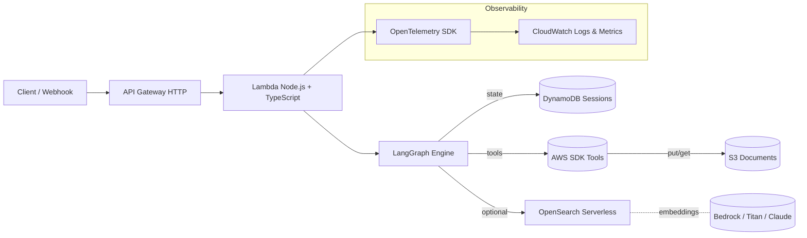
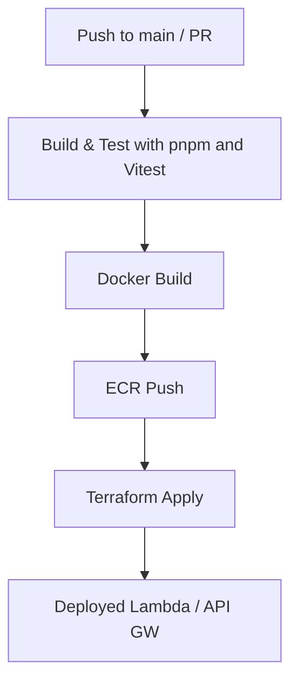

# LangGraph Conversational Agent

[](https://github.com/PabloGalante/langgraph-aws-agent/actions)
[](LICENSE)


A cloud-native conversational AI built with **Node.js**, **TypeScript**, and **LangGraph**, designed for scalability, observability, and modern software engineering practices. This project demonstrates architectural thinking, CI/CD automation, containerization, and AWS integration — aligned with real-world cloud developer and architect roles.

---

## 🚀 Overview

This agent is a **modular conversational framework** that runs on AWS using **Lambda** or **ECS Fargate**, orchestrated via **LangGraph**. It supports persistent conversation state, tool orchestration (RAG, search, file uploads), observability with OpenTelemetry, and an Infrastructure-as-Code foundation using Terraform.

### ✳️ Core Features

- **LangGraph-based orchestration** with modular nodes and explicit control flow  
- **Memory persistence** in DynamoDB (session + turn model)  
- **REST API** built with [Hono](https://hono.dev)  
- **RAG support** (optional) with AWS Bedrock + OpenSearch Serverless  
- **OpenTelemetry instrumentation** → CloudWatch metrics & traces  
- **CI/CD pipeline** via GitHub Actions → ECR + Lambda/ECS deployment  
- **Comprehensive testing** using Vitest + Supertest  
- **IaC provisioning** using Terraform

---

## 🧩 Architecture



### Main AWS Components

| Component | Purpose |
|------------|----------|
| **API Gateway (HTTP)** | REST interface for chat and session handling |
| **Lambda Function** | Runs the conversational agent (Docker image) |
| **DynamoDB** | Stores session state and message history |
| **S3 (optional)** | Stores uploaded user documents |
| **OpenSearch Serverless** | Vector search for RAG queries |
| **Bedrock (optional)** | Invokes Claude or Titan models for reasoning |
| **CloudWatch** | Logs, metrics, and traces via OpenTelemetry |

---

## 📁 Project Structure

```plain
langgraph-aws-agent/
├─ apps/
│  └─ api/                # REST API (Hono + Lambda adapter)
├─ packages/
│  ├─ agent-core/         # LangGraph nodes, tools, and state management
│  ├─ types/              # Shared Zod/TypeScript schemas
│  └─ observability/      # OpenTelemetry setup
├─ infra/
│  └─ terraform/          # AWS infrastructure definitions
├─ tests/
│  ├─ unit/
│  └─ integration/
├─ .github/workflows/
│  └─ ci-cd.yml           # Build, test, and deploy pipeline
└─ README.md
```

Monorepo managed with **pnpm workspaces** for modular development and isolated testing.

---

## 🧠 LangGraph Overview

The conversational logic is expressed as a **state graph** — a directed acyclic graph (DAG) where each node performs a reasoning or tool-execution step.

```text
policy → plan → tool-exec → respond → persist
```

Each node receives and returns a typed `AgentState`, persisted in DynamoDB. This makes the system resilient, idempotent, and testable at the node level.

### Example: Agent State

```ts
export interface AgentState {
  sessionId: string;
  messages: { role: 'user' | 'assistant' | 'tool'; content: string; ts: number }[];
  needRag?: boolean;
  toolRequests?: { name: string; args: unknown }[];
}
```

---

## ⚙️ Setup & Installation

### 1️⃣ Clone & Install

```bash
git clone https://github.com/yourusername/langgraph-aws-agent.git
cd langgraph-aws-agent
corepack enable
pnpm install
```

### 2️⃣ Environment Variables

Create a `.env` file in the project root:

```plain
AWS_REGION=us-east-1
SESSION_TABLE=agent-sessions
BEDROCK_MODEL_ID=anthropic.claude-3-5-sonnet-20240620
OTEL_EXPORTER_OTLP_ENDPOINT=https://api.honeycomb.io
OTEL_EXPORTER_OTLP_HEADERS=x-honeycomb-team=your-api-key
```

You can replace Bedrock with OpenAI or Anthropic keys if you prefer.

---

## 🧱 Building & Running Locally

### Development Mode

```bash
pnpm -r build
pnpm -F @agent-core dev
pnpm -F api dev
```

### Docker Build

```bash
docker build -t langgraph-agent -f apps/api/Dockerfile .
docker run -p 3000:3000 langgraph-agent
```

### Lambda Local (Optional)

Use [AWS SAM CLI](https://docs.aws.amazon.com/serverless-application-model/latest/developerguide/what-is-sam.html):

```bash
sam local start-api --template sam.yaml
```

---

## 🧪 Testing

Run all tests:

```bash
pnpm test
```

Run unit tests only:

```bash
pnpm run test:unit
```

Run integration tests:

```bash
pnpm run test:integration
```

Example snippet:

```ts
import { buildGraph } from '@agent-core/graph';
const graph = buildGraph();
const output = await graph.invoke({
  sessionId: 't1',
  messages: [{ role: 'user', content: 'Hello', ts: Date.now() }]
});
console.log(output.messages.at(-1)?.content);
```

---

## 🧰 Infrastructure Deployment (Terraform)

```bash
cd infra/terraform
terraform init
terraform apply -var="region=us-east-1" \
                -var="session_table_name=agent-sessions" \
                -var="image_uri=123456789.dkr.ecr.us-east-1.amazonaws.com/langgraph-agent:latest"
```

This will create:

- DynamoDB table  
- IAM role  
- Lambda function (from ECR image)  
- API Gateway HTTP endpoint

---

## 🧮 CI/CD Pipeline

### GitHub Actions



**Workflow summary**  

1) Build & test monorepo → 2) Build & push Docker image → 3) Apply Terraform → 4) Update Lambda / API Gateway.

`.github/workflows/ci-cd.yml` (excerpt):

```yaml
on:
  push: { branches: [ main ] }

jobs:
  build-test:
    runs-on: ubuntu-latest
    steps:
      - uses: actions/checkout@v4
      - uses: pnpm/action-setup@v3
      - run: corepack enable && pnpm i --frozen-lockfile
      - run: pnpm -r build && pnpm -r test

  deploy:
    needs: build-test
    runs-on: ubuntu-latest
    steps:
      - uses: actions/checkout@v4
      - uses: aws-actions/configure-aws-credentials@v4
        with:
          role-to-assume: ${{ secrets.AWS_ROLE_ARN }}
          aws-region: ${{ secrets.AWS_REGION }}
      - uses: aws-actions/amazon-ecr-login@v2
      - run: |
          IMAGE="${{ steps.ecr.outputs.registry }}/langgraph-agent:${{ github.sha }}"
          docker build -t $IMAGE apps/api
          docker push $IMAGE
          echo "image=$IMAGE" >> $GITHUB_OUTPUT
        id: img
      - name: Deploy Terraform
        run: |
          cd infra/terraform
          terraform init -input=false
          terraform apply -auto-approve \
            -var="region=${{ secrets.AWS_REGION }}" \
            -var="image_uri=${{ steps.img.outputs.image }}" \
            -var="session_table_name=agent-sessions"
```

---

## 📊 Observability

The agent integrates **OpenTelemetry SDK** for tracing, metrics, and logs.

```ts
import { NodeSDK } from '@opentelemetry/sdk-node';
const sdk = new NodeSDK({
  serviceName: 'langgraph-agent',
  // use OTLP exporter or CloudWatch via a collector/sidecar
});
sdk.start();
```

Traces appear in **CloudWatch**, **Datadog**, or **Honeycomb** depending on configuration.

---

## 🧱 Security

- All secrets stored in **AWS Systems Manager Parameter Store**  
- IAM policies follow **least-privilege principle**  
- HTTPS enforced via API Gateway  
- Inputs validated with **Zod** schemas  
- CORS restricted by environment

---

## 📈 Future Enhancements

- WebSocket or SSE streaming for real-time token responses  
- Multi-tool orchestration (calendar, ticketing, notifications)  
- RAG pipeline with embeddings (Titan / OpenAI)  
- Fine-grained tracing per graph node  
- Web dashboard for session insights

---

## 🗨️ Example API Usage

### Create a Session

```bash
curl -X POST https://api.example.com/sessions
```

#### Response1

```json
{ "sessionId": "f9a1c33d-abc4-4891-bd4a-9b32a0fef111" }
```

### Send a Message

```bash
curl -X POST https://api.example.com/chat/f9a1c33d-abc4-4891-bd4a-9b32a0fef111 \
  -H "Content-Type: application/json" \
  -d '{"message": "Explain AWS Lambda in simple terms."}'
```

#### Response2

```json
{
  "reply": "AWS Lambda lets you run code without managing servers. You pay per invocation and execution time.",
  "stateVersion": 3
}
```

---

## 🧭 Design Decisions (ADRs)

| ID | Title | Decision |
|----|--------|-----------|
| 001 | **Serverless over ECS** | Chose Lambda for simplicity, low cost, and auto-scaling |
| 002 | **DynamoDB over RDS** | Simpler schema, auto-scaling, and high availability |
| 003 | **Bedrock over OpenAI** | Unified AWS IAM + no external API keys |
| 004 | **LangGraph over custom FSM** | Better composability and introspection per node |

---

## 🧑‍💻 Author

**Pablo Galante**  
Cloud Engineer & Software Developer  
☁️ Focused on scalable cloud architecture, DevOps, and conversational AI.  
🔗 [LinkedIn](https://www.linkedin.com/in/pablogastongalante) — [GitHub](https://github.com/PabloGalante)

---

## 📜 License

MIT © 2025
